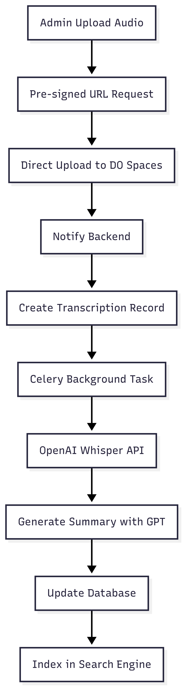
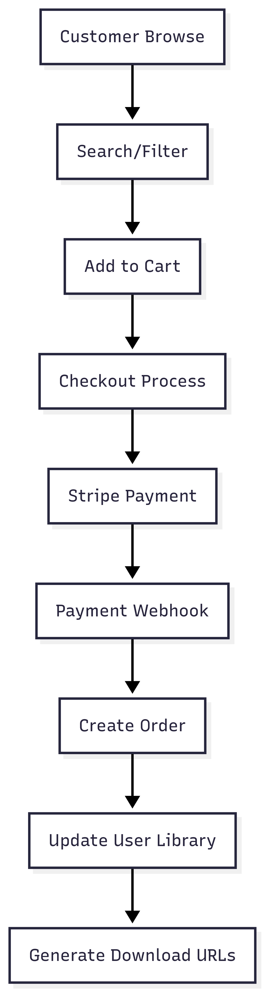
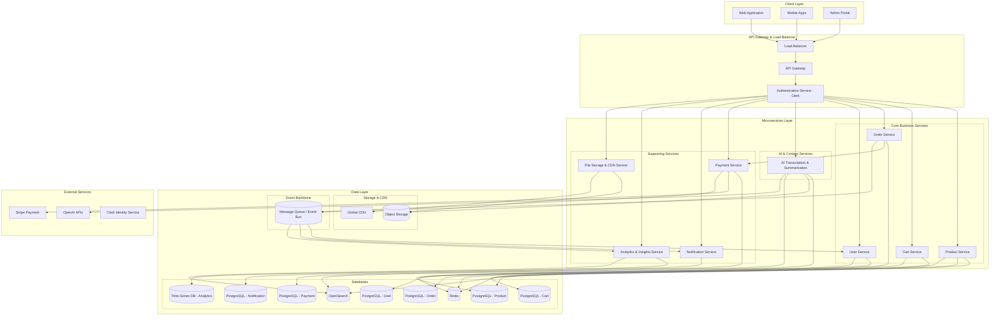

# Audiobook E-commerce System Design


In this README, I’ve outlined two implementation approaches: the current solution and an alternative designed with high scalability in mind.

## Approach #1: Current Implementation (MVP/Monolithic)

### Architecture Overview


### Database Schema


## How to run the current application

### Requirements

1. NodeJs v22.13.0
2. Docker 27.4.0

### 1. Clone the repository
```
git clone https://github.com/rahul-kanneri-personal/audiobook.git

// Run Backend in one terminal

cd apps/backend
cp .env.example .env
docker-compose up

// Run Frontend in another terminal

cd apps/frontend
cp .env.example .env
pnpm install
pnpm dev

// Visit: http://localhost:3000/ to access the store frontend
// Visit: http://localhost:3000/admin/ to access the admin panel

Username: rahulrcn@gmail.com
Password: 
```

## Requirements and Goals of the System

**Frontend (NextJS)**
- **Framework**: Next.js 15+ with App Router
- **Authentication**: Clerk React SDK
- **Styling**: Tailwind CSS
- **State Management**: React Query + Zustand
- **File Upload**: Direct to Digital Ocean Spaces with signed URLs

**Backend (Single Service)**
- **Runtime**: Python 3.11+
- **Framework**: FastAPI
- **Database**: PostgreSQL with SQLAlchemy ORM, Alembic Migration
- **Queue**: Celery with Redis broker
- **File Storage**: boto3 for Digital Ocean Spaces
- **AI Services**: OpenAI Python SDK (Whisper for transcription, GPT for summarization)
- **Payment**: Stripe Python SDK

**Infrastructure**
- **Database**: PostgreSQL
- **Cache/Queue**: Redis
- **File Storage**: Digital Ocean Spaces
- **Deployment**: Docker containers

### Authentication Strategy
The current MVP uses Clerk as the identity provider for rapid development, supporting email/password and social authentication. For production scalability, alternative providers like AWS Cognito, Supabase Auth, or open-source solutions like KeyCloak would be more cost-effective for high user volumes.

### File Upload Architecture
Files are uploaded directly to Digital Ocean Spaces using pre-signed URLs, reducing backend load:

1. **Frontend** requests pre-signed URL from **Backend**
2. **Frontend** uploads directly to **Storage**
3. **Frontend** notifies **Backend** of successful upload
4. **Backend** triggers AI processing pipeline

### AI-Powered Content Processing

**Transcription Pipeline**:
1. Audio file uploaded → Stored in Digital Ocean Spaces
2. Backend triggers Celery background task
3. OpenAI Whisper API processes audio → Generates accurate transcription
4. GPT API generates intelligent summary
5. Content indexed in search engine for enhanced discoverability

**Data Flow Diagrams**:

**Admin Flow**:




**User Flow**:



## Approach #2: Microservices Architecture (High Scalability Implementation)

### Complete Microservices List

#### 1. Product Service
**Technology**: FastAPI + Opensearch + PostgreSQL + Redis

**Responsibilities**:
- Audiobook catalog management
- Advanced search with AI-enhanced content indexing
- Category and metadata management
- Author/narrator information
- AI-generated summaries and transcriptions display
- Content recommendations based on transcription analysis

**Database Strategy**:
- **Primary**: PostgreSQL (audiobooks, categories, authors, audio_files)
- **Search**: OpenSearch (full-text search on transcriptions and to store vector embeddings for AI powered recommendation)
- **Cache**: Redis (frequently accessed audiobook data)

#### 2. Cart Service
**Technology**: FastAPI + Redis + PostgreSQL

**Responsibilities**:
- Shopping cart state management
- Session persistence for guest and authenticated users
- Cart synchronization across devices
- Cart abandonment tracking for marketing

**Storage Strategy**:
- **Primary**: Redis (ultra-fast cart operations)
- **Backup**: PostgreSQL (cart_items table for persistence)

#### 3. Order Service
**Technology**: FastAPI + PostgreSQL + Kafka

**Responsibilities**:
- End-to-end order lifecycle management
- Order history and detailed tracking
- Post-purchase library access provisioning
- Order analytics and reporting
- Refund and dispute handling (If needed)

#### 4. Payment Service
**Technology**: FastAPI + Stripe SDK + PostgreSQL

**Responsibilities**:
- Secure payment processing via Stripe
- Webhook handling for real-time payment events
- Refund and chargeback management
- Payment method storage and management
- Subscription billing and credit system
- PCI DSS compliance maintenance

#### 5. AI Transcription & Summarization Service
**Technology**: FastAPI + Celery + OpenAI SDK + PostgreSQL + File Storage

**Responsibilities**:
- **Audio Transcription**: OpenAI Whisper API integration for accurate speech-to-text
- **Content Summarization**: GPT-powered chapter and book summaries
- **Content Analysis**: Extract themes, topics, and metadata
- **Quality Assurance**: Transcription accuracy validation
- **Batch Processing**: Efficient processing of large audio files
- **Language Detection**: Multi-language transcription support

#### 6. User Service
**Technology**: FastAPI + PostgreSQL + Clerk Integration + Redis

**Responsibilities**:
- Admin User and customer profile and preference management
- Library management (purchased audiobooks)
- Reading progress and bookmark synchronization
- User behavior analytics collection
- Personalization settings and preferences
- Social features (reviews, ratings, following)

**Integration Points**:
- **Clerk**: Authentication and identity management

#### 7. Notification Service
**Technology**: FastAPI + Message Queue + Email/SMS Providers (Sendgrid/Resend + Twillio) + WebSocket

**Responsibilities**:
- **Multi-Channel Notifications**: Email, SMS, push notifications, in-app messages
- **Event-Driven Messaging**: Order confirmations, payment receipts, new releases
- **Personalized Campaigns**: Targeted marketing based on user preferences
- **Real-Time Notifications**: Instant updates via WebSocket connections (If needed)
- **Notification Preferences**: Granular user control over notification types

#### 8. Analytics & Insights Service
**Technology**: FastAPI + Time-Series DB

**Responsibilities**:
- **User Behavior Analytics**: Listening patterns, engagement metrics, drop-off analysis
- **Content Performance**: Popular books, completion rates, user ratings correlation
- **Business Intelligence**: Revenue analytics, subscription metrics, churn analysis

#### 9. File Storage & CDN Service
**Technology**: Object Storage + Global CDN

**Responsibilities**:
- **Global Content Distribution**: 200+ edge locations worldwide
- **Storage Optimization**: Multiple quality versions and intelligent compression
- **Performance**: Pre-loading and intelligent caching strategies
- **Cost Optimization**: Tiered storage based on content popularity (Glacier for the archieved audiobooks)

### Technology Stack Comparison

| Component | Current (Monolith) | Future (Microservices) |
|-----------|-------------------|------------------------|
| **Backend** | FastAPI (Single) | FastAPI (12+ Services) |
| **Database** | PostgreSQL (Single) | PostgreSQL + Opensearch + Redis |
| **AI Processing** | OpenAI SDK (Direct) | Dedicated AI Service with Queue |
| **Search** | Basic SQL queries | Opensearch with AI-enhanced indexing |
| **Queue** | Celery + Redis | Celery + Kafka |
| **Frontend** | NextJS (Single) | Micro-frontends + NextJS |
| **Authentication** | Clerk Direct + User table | Clerk + API Gateway + User Service |
| **File Storage** | DO Spaces Direct | Multi-tier Storage + Global CDN |
| **Monitoring** | Basic logging | APM + Distributed tracing + Analytics |
| **Caching** | Redis (Simple) | Multi-layer caching strategy |
| **Payment** | Stripe Direct | Dedicated Payment Service |

### Migration Strategy from Monolith to Microservices (Gradual migration)

**Phase 1: Extract AI & Content Services (Months 1-2)**
- Extract AI Transcription & Summarization Service
- Implement event-driven processing
- Set up dedicated job queues
- Extract Content Management Service

**Phase 2: Extract User-Facing Services (Months 3-4)**
- Extract Product Service with Opensearch
- Implement API Gateway with routing
- Extract Search & Recommendation Service
- Set up distributed caching

**Phase 3: Extract E-commerce Services (Months 5-6)**
- Extract Cart Service with Redis optimization
- Extract Order Service with event streaming
- Extract Payment Service with enhanced security
- Implement comprehensive event architecture

**Phase 4: Advanced Services & Optimization (Months 7-8)**
- Extract Streaming & Playback Service
- Extract Notification Service
- Extract Analytics & Insights Service
- Implement micro-frontend architecture

**Phase 5: Performance & Scale Optimization (Months 9-10)**
- Global CDN deployment
- Advanced caching strategies
- Performance monitoring and optimization
- Load testing and capacity planning

### Micro-Frontend Architecture

**Customer Portal MFEs**:
- **Product Catalog MFE**: Browse and search functionality
- **Product Details MFE**: Individual audiobook pages with AI summaries
- **Cart & Checkout MFE**: Shopping cart and payment processing
- **User Library MFE**: Personal audiobook collection with playback
- **Profile Settings MFE**: Account management and preferences

**Admin Portal MFEs**:
- **Content Management MFE**: Upload and manage audiobooks
- **Analytics Dashboard MFE**: Business insights and reporting
- **User Management MFE**: Customer support and user administration
- **AI Processing Monitor MFE**: Transcription and summarization status

### High-Level System Architecture Diagram




## Scalability Considerations

### Horizontal Scaling
- **Microservices Architecture**: Independent scaling of each service based on demand
- **Stateless Services**: All services designed to be stateless for easy horizontal scaling

### Caching Strategy
- **Multi-Layer Caching**: Browser cache → CDN → Application cache → Database cache

### Performance Optimization
- **Audio Compression**: Load content based on internet speed
- **Lazy Loading**: Load content metadata on-demand
- **Async Processing**: Non-blocking operations for all I/O intensive tasks (Background tasks)

## Monitoring & Observability

### Key Metrics
- **User Engagement**: Session duration, completion rates, retention
- **System Performance**: Response times, throughput, error rates
- **Business Metrics**: Conversion rates, subscription churn, revenue per user

### Alerting Strategy
- **Tiered Alerting**: Critical (on-call alerts in slack)
- **Automated Recovery**: Self-healing systems for common failures
- **Performance Baselines**: 99.99% availablity on all services
